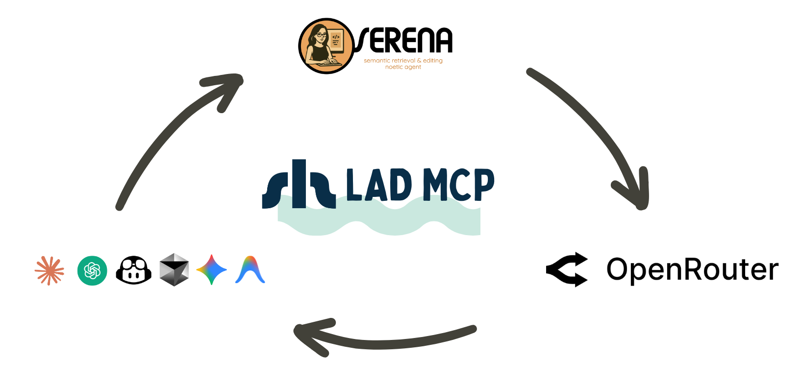
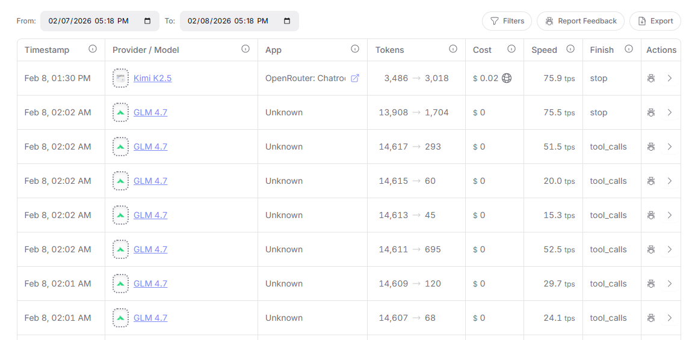
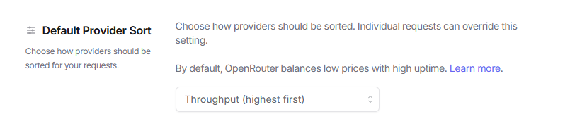

# Improve AI-generated code quality by 20%

**Project-aware AI code review for AI coding agents.**

Part of the **[Shelpuk AI Technology Consulting](https://shelpuk.com) agentic suite** – a set of tools that together improve the code quality produced by AI coding agents by **15–20%**.

Works with **Claude Code**, **Codex**, **Antigravity**, **Cursor**, **Windsurf**, and any agent that supports skills or MCP servers.

| Component                                                                                             | Role |
|-------------------------------------------------------------------------------------------------------|---|
| [tdd](https://github.com/Shelpuk-AI-Technology-Consulting/agent-skill-tdd)                            | Enforces TDD, requirements discipline, and peer review for every coding task |
| [Serena](https://github.com/oraios/serena)                                                            | Semantic code navigation + persistent project memory |
| [Kindly Web Search](https://github.com/Shelpuk-AI-Technology-Consulting/kindly-web-search-mcp-server) | Up-to-date API and package documentation via web search |
| **Lad MCP Server** ← you are here                                                                     | Project-aware AI design and code review |

If you like what we're building, please ⭐ **star this repo** – it's a huge motivation for us to keep going!

# Lad MCP PServer



## Why review AI-generated code with another AI?

Picture this: Your coding agent just spent 20 minutes refactoring your authentication module. The code looks clean, passes tests, and the agent is confident. You merge it. Three days later, you discover it breaks the SSO integration that was documented in a design decision from two months ago – a decision the agent never saw.

This isn't a bug in the code. It's a bug in the **context**.

### The "Bad Token" Problem

LLMs generate text token by token. Each new token is chosen to maximize coherence with all previous tokens. So when an agent makes a questionable design choice early on, every subsequent token tries to justify and reinforce that mistake to maintain cohesion. The agent effectively **gaslights itself**.

Think of it like this: if you start a sentence with a wrong assumption, your brain automatically tries to make the rest of the sentence sound convincing – even if the premise is flawed. LLMs do the same thing, but they can't step back and question their earlier choices.

When generating large code segments, "if" the agent makes a bad choice becomes "**when**" – it's statistically inevitable.

**The solution?** A fresh pair of eyes. A second LLM that isn't constrained by the first agent's token history can spot these coherence-driven mistakes that the original agent is blind to.

## What's wrong with existing AI code review solutions?

At [Shelpuk AI Technology Consulting](https://shelpuk.com), we build custom AI products under a fixed-price model. Development efficiency isn't optional – it's how we stay profitable. We've been using AI coding assistants since 2023 (GitHub Copilot, Cursor, Windsurf, Claude Code, Codex), and we needed our agents' code reviewed by state-of-the-art open-source models via **OpenRouter**.

Why OpenRouter? It's a unified gateway to both private and open-source models with Bring Your Own Key support. Essentially, **OpenRouter is all you need** :)

*(Disclaimer: We are not affiliated with OpenRouter in any way.)*

We tried the **PAL MCP server** for OpenRouter-based review, but it failed us for two reasons:

### Problem 1: Manual per-model configuration

PAL requires package-level configuration for every OpenRouter model. Without it, PAL assumes a 32k context window and limits file input to ~6k tokens – clearly insufficient for code review tasks.

We even submitted PRs to add support for cutting-edge models like `moonshotai/kimi-k2-thinking` and `z-ai/glm-4.7` (current SOTA open-source models), but they've been sitting open for months. The PAL team seems overwhelmed, and the approach doesn't scale.

### Problem 2: The bigger issue – lack of project context

This is the **real** problem with AI-reviewing-AI.

When a human engineer reviews a diff, they don't just check if the code "makes sense in isolation." They evaluate it against:
- Requirements from the spec
- Team constraints and conventions
- Prior architectural decisions
- Design patterns used in other modules
- Debug notes from similar past issues

Most of the review value doesn't come from catching logical contradictions in the code itself – AI-generated code rarely has those. The value comes from spotting **gaps, inconsistencies, and contradictions with the larger system**.

Most AI code reviewers are "amnesic" – they see the diff, but not the project's history, requirements, or architectural context. They're reviewing in a vacuum.

## How Lad solves this

We built **Lad** for our internal use and decided to open-source it. Here's what makes it different:

### Zero-config OpenRouter integration

✅ Lad fetches model metadata (context window size, tool calling support) directly from OpenRouter via the OpenRouter API.

✅ If a model is available on OpenRouter, Lad can use it – **no manual configuration needed**.

✅ New models? They just work.

### Dual-reviewer mode by default

✅ Lad runs **two reviewers in parallel** (default: `moonshotai/kimi-k2.5` and `z-ai/glm-5`)

✅ Reduces individual model bias and catches more issues

✅ Returns both reviews plus a synthesized summary

✅ You can switch to single-reviewer mode with `OPENROUTER_SECONDARY_REVIEWER_MODEL=0`

### Project-aware review (the killer feature)

**Note:** This feature is **optional** – Lad works perfectly fine without Serena for basic code review. However, if you want project-aware review with long-term memory and codebase indexing, Serena integration provides significant advantages.

✅ Lad can integrate with **Serena** – a "headless IDE" for AI coding agents

✅ Serena provides token-efficient project indexing and persistent "memories"

✅ Your agents can record requirements, design decisions, debug findings, and more

✅ Memories survive across coding sessions and can be shared across teams

*(Disclaimer: We are not affiliated with Serena in any way.)*

**Here's the magic when Serena is available:** Lad connects your Serena repository index and memories to the reviewer LLMs. Now the reviewing agent can:
- Spot inconsistencies with other system modules
- Catch mismatches with requirements settled months ago
- Reference design decisions from your project's memory bank
- Review code in the context of your **entire project history**, not just the diff

This is what human reviewers do – and now your AI reviewer can too.

**Without Serena:** Lad still provides excellent dual-reviewer code analysis, but reviews will be based solely on the code you submit, without access to project history, requirements, or architectural context.

### Workflow integration

✅ **`system_design_review`** for planning and architectural decisions

✅ **`code_review`** for implementation and diffs

✅ Both tools support text input **and** file references via `paths` – no need to regenerate code for review

### Works everywhere

Lad works with **Claude Code**, **Codex**, **Cursor**, **Antigravity**, **Windsurf**, and any other MCP client that supports stdio servers. It can also run as a standalone Docker-based tool.

### Battle-tested in production

We've been using Lad daily for months in our production work. It's caught countless issues that would've slipped through – inconsistencies with requirements, architectural mismatches, and those subtle "bad token" effects that are invisible to the original coding agent.

If you give it a try or like the idea, please drop us a star on GitHub – it's huge motivation for us to keep improving it! ⭐️

**P.S.** Check out our [Kindly Web Search MCP server](https://github.com/Shelpuk-AI-Technology-Consulting/kindly-web-search-mcp-server) – perhaps the only web search MCP for coding agents that actually works. It pairs perfectly with Lad for a complete research-and-review workflow.

## What Lad replaces

Lad eliminates the need for:

✅ Manual OpenRouter model configuration

✅ Context-blind AI code reviewers

✅ Separate tools for design review vs. code review

✅ Constantly re-explaining requirements to reviewers

## Tools

Lad exposes two MCP tools:

- **`system_design_review`**  –  Reviews architectural proposals, design documents, and planning decisions
- **`code_review`**  –  Reviews implementation code, diffs, and file changes

Each tool runs **two OpenRouter-backed reviewers in parallel** (Primary + Secondary) and returns both outputs plus a synthesized summary.


## Requirements

- Python 3.11+
- `uv` (recommended) or `pip`
- `OPENROUTER_API_KEY` (required)

## Quickstart

Run command used by MCP clients (stdio):

```bash
uvx --from git+https://github.com/Shelpuk-AI-Technology-Consulting/lad_mcp_server \
  lad-mcp-server
```

First-run note: the first `uvx` invocation may take 30–60 seconds while it builds the tool environment. If your MCP client times out on first start, run the command once in a terminal to “prewarm” it, then retry in your client.

## Install & run (local development)

Lad ships a stdio CLI entrypoint: `lad-mcp-server`.

- From a local checkout (recommended for development): `uv run lad-mcp-server`
- From a published package (when installed): `lad-mcp-server`

## Client setup

All client examples below run Lad over **stdio** (the MCP client spawns the server process).

Make sure `OPENROUTER_API_KEY` is available to the MCP client:
- either set it in your OS environment, or
- paste it directly into the client config (not recommended for repos you commit).

### Codex (Codex CLI)

Install Codex CLI:

```bash
npm i -g @openai/codex
```

CLI (no file editing)  –  add a local stdio MCP server (macOS / Linux):

```bash
codex mcp add lad \
  --env OPENROUTER_API_KEY="$OPENROUTER_API_KEY" \
  -- uvx --from git+https://github.com/Shelpuk-AI-Technology-Consulting/lad_mcp_server \
  lad-mcp-server
```

Windows (PowerShell):

```powershell
codex mcp add lad `
  --env OPENROUTER_API_KEY="$env:OPENROUTER_API_KEY" `
  -- uvx --from git+https://github.com/Shelpuk-AI-Technology-Consulting/lad_mcp_server `
  lad-mcp-server
```

Alternative (file-based):
Edit `~/.codex/config.toml` (or project-scoped `.codex/config.toml` in trusted projects):

```toml
[mcp_servers.lad]
command = "uvx"
args = [
  "--from",
  "git+https://github.com/Shelpuk-AI-Technology-Consulting/lad_mcp_server",
  "lad-mcp-server",
]
# Forward variables from your shell/OS environment:
env_vars = ["OPENROUTER_API_KEY"]
startup_timeout_sec = 120.0
```

### Claude Code

CLI (no file editing)  –  add a local stdio MCP server (macOS / Linux):

```bash
claude mcp add --transport stdio lad \
  -e OPENROUTER_API_KEY="$OPENROUTER_API_KEY" \
  -- uvx --from git+https://github.com/Shelpuk-AI-Technology-Consulting/lad_mcp_server \
  lad-mcp-server
```

Windows (PowerShell):

```powershell
claude mcp add --transport stdio lad `
  -e OPENROUTER_API_KEY="$env:OPENROUTER_API_KEY" `
  -- uvx --from git+https://github.com/Shelpuk-AI-Technology-Consulting/lad_mcp_server `
  lad-mcp-server
```

If Claude Code times out while starting the server, increase the startup timeout (milliseconds):

macOS / Linux:
```bash
export MCP_TIMEOUT=120000
```

Windows (PowerShell):
```powershell
$env:MCP_TIMEOUT="120000"
```

Alternative (file-based):
Create/edit `.mcp.json` (project scope; recommended for teams):

```json
{
  "mcpServers": {
    "lad": {
      "command": "uvx",
      "args": [
        "--from",
        "git+https://github.com/Shelpuk-AI-Technology-Consulting/lad_mcp_server",
        "lad-mcp-server"
      ],
      "env": {
        "OPENROUTER_API_KEY": "${OPENROUTER_API_KEY}"
      }
    }
  }
}
```

### Cursor

Create `.cursor/mcp.json` (project) or `~/.cursor/mcp.json` (global):

```json
{
  "mcpServers": {
    "lad": {
      "type": "stdio",
      "command": "uvx",
      "args": [
        "--from",
        "git+https://github.com/Shelpuk-AI-Technology-Consulting/lad_mcp_server",
        "lad-mcp-server"
      ],
      "env": {
        "OPENROUTER_API_KEY": "${env:OPENROUTER_API_KEY}"
      }
    }
  }
}
```

Startup timeout: Cursor does not always expose a per-server startup timeout. If the first run is slow, run the `uvx` command once in a terminal to prebuild the tool environment, then restart Cursor.

### Gemini CLI

You can configure MCP servers via CLI or by editing `settings.json`.

CLI (adds to `.gemini/settings.json` by default; use `-s user` for `~/.gemini/settings.json`):

```bash
gemini mcp add -s user -t stdio \
  -e OPENROUTER_API_KEY="$OPENROUTER_API_KEY" \
  lad uvx --from git+https://github.com/Shelpuk-AI-Technology-Consulting/lad_mcp_server lad-mcp-server
```

Alternative (file-based):
Edit `~/.gemini/settings.json` (or `.gemini/settings.json` in a project):

```json
{
  "mcpServers": {
    "lad": {
      "command": "uvx",
      "args": [
        "--from",
        "git+https://github.com/Shelpuk-AI-Technology-Consulting/lad_mcp_server",
        "lad-mcp-server"
      ],
      "env": {
        "OPENROUTER_API_KEY": "$OPENROUTER_API_KEY"
      },
      "timeout": 120000,
      "trust": false
    }
  }
}
```

### Windsurf

Windsurf stores MCP servers in `~/.codeium/windsurf/mcp_config.json`.

In Windsurf:
1. Open **Cascade**
2. Click **MCPs** (top-right)
3. Click **Manage MCP Servers**
4. Click **View raw config** (opens `mcp_config.json`)
5. Add the server under `mcpServers`, save, then click **Refresh**

Paste this into your `mcpServers` object (don’t overwrite other servers):

```json
{
  "lad": {
    "command": "uvx",
    "args": [
      "--from",
      "git+https://github.com/Shelpuk-AI-Technology-Consulting/lad_mcp_server",
      "lad-mcp-server"
    ],
    "env": {
      "OPENROUTER_API_KEY": "${env:OPENROUTER_API_KEY}"
    }
  }
}
```

If Windsurf can’t find `uvx`, replace `"uvx"` with an absolute path (run `which uvx` in a terminal).

### Antigravity

In Antigravity, open the MCP store, then:
1. Click **Manage MCP Servers**
2. Click **View raw config** (opens `mcp_config.json`)
3. Add the server config under `mcpServers`, save, then go back and click **Refresh**

Paste this into your `mcpServers` object (don’t overwrite other servers):

```json
{
  "lad": {
    "command": "uvx",
    "args": [
      "--from",
      "git+https://github.com/Shelpuk-AI-Technology-Consulting/lad_mcp_server",
      "lad-mcp-server"
    ],
    "env": {
      "OPENROUTER_API_KEY": "PASTE_OPENROUTER_KEY_HERE"
    }
  }
}
```

Replace `PASTE_OPENROUTER_KEY_HERE` with your actual key.

If Antigravity can’t find `uvx`, replace `"uvx"` with an absolute path (run `which uvx` in a terminal).

## Configuration (environment variables)

### Required

- `OPENROUTER_API_KEY`

### OpenRouter models

- `OPENROUTER_PRIMARY_REVIEWER_MODEL` (default: `moonshotai/kimi-k2.5`)
- `OPENROUTER_SECONDARY_REVIEWER_MODEL` (default: `z-ai/glm-5`)
  - Set to `0` to disable the Secondary reviewer (Primary-only mode).

### OpenRouter request behavior

- `OPENROUTER_MAX_CONCURRENT_REQUESTS` (default: `4`)
- `OPENROUTER_REVIEWER_TIMEOUT_SECONDS` (default: `300`, wall-clock per reviewer run)
- `OPENROUTER_TOOL_CALL_TIMEOUT_SECONDS` (default: `360`, per tool call; must be >= reviewer timeout)
- `OPENROUTER_HTTP_REFERER` (optional; forwarded to OpenRouter)
- `OPENROUTER_X_TITLE` (optional; forwarded to OpenRouter)

### Budgeting / limits

- `OPENROUTER_FIXED_OUTPUT_TOKENS` (default: `8192`)
- `OPENROUTER_CONTEXT_OVERHEAD_TOKENS` (default: `2000`)
- `OPENROUTER_MODEL_METADATA_TTL_SECONDS` (default: `3600`)
- `OPENROUTER_MAX_INPUT_CHARS` (default: `100000`)
- `OPENROUTER_INCLUDE_REASONING` (default: `false`)

Note: if your reviewer output is frequently cut off, increase `OPENROUTER_FIXED_OUTPUT_TOKENS` (this reduces room for file context in the prompt).

### Serena bridge (optional – only when `.serena/` exists and tool calling is supported)

**Note:** These variables are only used when Serena integration is active. You don't need to set them if you're not using Serena.

- `LAD_SERENA_MAX_TOOL_CALLS` (default: `32`)
- `LAD_SERENA_TOOL_TIMEOUT_SECONDS` (default: `30`)
- `LAD_SERENA_MAX_TOOL_RESULT_CHARS` (default: `12000`)
- `LAD_SERENA_MAX_TOTAL_CHARS` (default: `50000`)
- `LAD_SERENA_MAX_DIR_ENTRIES` (default: `100`)
- `LAD_SERENA_MAX_SEARCH_RESULTS` (default: `20`)

### Env files (optional)

- `LAD_ENV_FILE` (optional `KEY=VALUE` file, loaded only for missing vars)
- `.env` (optional; loaded if `python-dotenv` is installed)

Precedence note: Lad never overrides variables that are already set in the process environment. It only fills missing variables from `LAD_ENV_FILE` first, then (optionally) from `.env`.

## Path-based review requests

Both tools accept either direct text (`proposal` / `code`) or `paths` (files/dirs under inferred project root). When `paths` are provided, Lad reads and embeds **text-like** files from disk (language-agnostic) and skips common binary files and oversized files.

During directory expansion, hidden files and directories (dotfiles) are skipped; pass an explicit path (e.g., `.gitignore`) if you want it included.

Example tool payloads:
- `system_design_review`: `{"paths":["src/retrieval.py"],"constraints":"..."}`
- `code_review`: `{"paths":["lad_mcp_server","tests"],"context":"Please prioritize correctness and failure modes in auth/session logic."}`

Notes:
- For multi-project usage (one Lad config for many repos), prefer **absolute** `paths`. Relative `paths` work when the MCP host starts Lad with CWD set to the project root (or when the host provides a workspace root).
- For safety, Lad rejects path-based reviews that resolve to obvious system roots (e.g. `/etc`, `/proc`, `C:\Windows`).

## Serena integration (optional)

**Serena is completely optional.** Lad works without Serena and will perform code reviews based on the code you provide. However, without Serena, reviewers won't have access to:
- Long-term project memory (requirements, design decisions, debug notes)
- Codebase index for exploring related modules
- Historical context from previous coding sessions

**If Serena is available:** When the repo being reviewed contains `.serena/` and the model supports tool calling, both reviewers automatically get a read-only Serena toolset (directory listing, file reads, memory reads, pattern search) and are instructed to call `activate_project(".")` first. This enables project-aware reviews with full context.

## Docker deployment (local stdio)

This is the most compatible Docker setup: your MCP client still runs Lad as a stdio server, but the process it spawns is `docker run ...` instead of `uvx ...`.

Build the image:

```bash
docker build -t lad-mcp-server .
```

Don’t bake API keys into the image. Pass them via environment variables at runtime.

Run Lad over stdio (for manual testing):

```bash
docker run --rm -i \
  -e OPENROUTER_API_KEY="..." \
  lad-mcp-server
```

Use Docker from an MCP client (example config fragment):

```json
{
  "lad": {
    "command": "docker",
    "args": [
      "run",
      "-i",
      "--rm",
      "-e",
      "OPENROUTER_API_KEY",
      "lad-mcp-server"
    ],
    "env": {
      "OPENROUTER_API_KEY": "${env:OPENROUTER_API_KEY}"
    }
  }
}
```

Note: stdio servers are **local-process** servers. If your client config uses `command`/`args`, it must be able to execute that command (locally), even if the command is `docker`.

## How to Speed Up Lad MCP Server

If you face timeouts or design / code review takes too long, you can improve the performance as follows.

### MCP Server Timeout Configuration

Both reviewers usually complete in under a minute, but for larger review tasks (especially with multiple Serena tool calls), set the **MCP tool execution timeout** to 5 minutes where your client supports it.

Important: the 5-minute recommendation is for **tool execution/request timeout**, not MCP server startup timeout.

As of February 8, 2026, timeout configuration differs by client:

**Codex** (supports both startup timeout and tool execution timeout in `config.toml`):
```toml
[mcp_servers.lad]
command = "uvx"
args = ["--from", "git+https://github.com/Shelpuk-AI-Technology-Consulting/lad_mcp_server", "lad-mcp-server"]
startup_timeout_sec = 60.0
tool_timeout_sec = 300.0
```
Docs: https://developers.openai.com/codex/mcp/

**Claude Code** (does not currently document a separate MCP tool execution timeout setting):
- `MCP_TIMEOUT` is documented as **startup timeout** (milliseconds), not tool execution timeout.
```bash
export MCP_TIMEOUT=120000
claude
```
Docs: https://code.claude.com/docs/en/mcp

**Cursor** (MCP config is documented, but no timeout key is documented in `mcp.json` fields):
- Documented fields include `command` / `args` / `env` / `envFile` (stdio), and `url` / `headers` / `auth` (remote).
- Workaround: prewarm once in a terminal, then restart Cursor:
```bash
uvx --from git+https://github.com/Shelpuk-AI-Technology-Consulting/lad_mcp_server lad-mcp-server
```
Docs: https://cursor.com/docs/context/mcp

**Gemini CLI** (supports per-server MCP request timeout in milliseconds via `timeout`):
```json
{
  "mcpServers": {
    "lad": {
      "command": "uvx",
      "args": [
        "--from",
        "git+https://github.com/Shelpuk-AI-Technology-Consulting/lad_mcp_server",
        "lad-mcp-server"
      ],
      "timeout": 300000,
      "trust": false
    }
  }
}
```
You can also set it from CLI when adding a server:
```bash
gemini mcp add --timeout 300000 lad uvx --from git+https://github.com/Shelpuk-AI-Technology-Consulting/lad_mcp_server lad-mcp-server
```
Docs: https://github.com/google-gemini/gemini-cli/blob/main/docs/tools/mcp-server.md

**Windsurf** (MCP config is documented, but no timeout key is documented in `mcp_config.json`):
- Use the same prewarm workaround if first run is slow.
Docs: https://docs.windsurf.com/windsurf/cascade/mcp

**Antigravity** (MCP integration is documented, but no timeout key is documented for custom `mcp_config.json` setup):
- Use the same prewarm workaround if first run is slow.
Docs: https://antigravity.google/docs/mcp

### Optimizing OpenRouter Configuration

Check OpenRouter Activity to see the throughput for your LLM calls:



If you see your LLM calls have low throughput (less than 30 tokens/second), consider restricting the low-throughput provider. For example, as of February 8, 2026, DeepInfra has very low throughput for both `moonshotai/kimi-k2.5` and `z-ai/glm-4.7`, so we restrict OpenRouter from routing our LLM calls there:


We also recommend that you prioritize OpenRouter providers by throughput:



## Troubleshooting

- First run is slow / client times out: run the `uvx` command from Quickstart once in a terminal to prewarm, then restart the client.
- “OPENROUTER_API_KEY is required”: ensure the MCP client process has access to the variable (or paste it into the client config).
- Secondary reviewer is too expensive/slow: set `OPENROUTER_SECONDARY_REVIEWER_MODEL=0`.

## Security notes

- Don’t commit API keys.
- Treat code review as data egress: anything you pass via `code`/`proposal` or `paths` may be sent to OpenRouter (after redaction).
- Prefer environment-variable forwarding (`env_vars` / `${env:...}`) over hardcoding secrets in config files.

## Dev helpers

- `python3 scripts/verify_openrouter_key.py` (fetches model list)
- `python3 scripts/verify_serena_usage.py` (ensures both reviewers used Serena and read `project_overview.md`)
